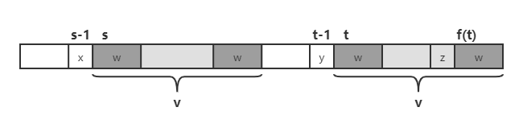

## 问题

给定文本字符串 $txt[0,n-1]$（以下称为 $T$） 和模式字符串 $pat[0,m-1]$（以下称为 $P$），在 $T$ 中查找 $P$（假定 $n\ge m\ge 1$）。

## Boyer-Moore 算法

BM 算法从右往左进行比较匹配，与 KMP 算法相似，BM 算法通过预处理模式串，使得匹配失败时，模式串可以向后移动多位，即利用模式串的一些特征，排除无法匹配的的位置，加快了匹配的速度。

BM 算法包含两个启发策略来移动模式串：**坏字符规则** 和 **好后缀规则**。

### 坏字符规则

当从右往左，出现匹配失败时，


我们称 **b** 为 **坏字符**，即不匹配的字符，此时分两种情况讨论：

如果模式串 $P$ 包含 **b**，将最右侧的 **b** 和坏字符对齐（若 **b** 在 **a** 右侧，则右移一位）；


$$
\begin{equation}
    shift(\text{'b'})=\max\{1,\ j+1-k\},\ k=\text{lastIndexOf('b') }
\end{equation}
$$

如果模式串 $P$ 在 **a** 的左侧不包含 **b**，则将整个模式串移至坏字符右侧。


$$
\begin{equation}
    shift(\text{'b'})=j+1
\end{equation}
$$

```java
class BM {
    // 如果字符集较小，可以用数组代替
    Map<Character, Integer> badChar(char[] pat) {
        Map<Character, Integer> lastIndices = new HashMap<>();
        for (int i = 0; i < pat.length; i++) {
            lastIndices.put(pat[i], i);
        }
        return lastIndices;
    }
}
```

### 好后缀规则

当从右往左，出现匹配失败时，


我们称已经匹配的部分 **u** 为 **好后缀**，此时分三种情况讨论：

1. 如果模式串 $P$ 在 **a** 的左侧包含 **u**，将其中最右侧的 **u** 与好后缀对齐；


$$
\begin{equation}
    shift(j)=j+2-k,\ k=\text{lastIndexOf(u,0,j+1) }
\end{equation}
$$

2. 如果模式串 $P$ 在 **a** 的左侧不存在完全匹配的 **u**，但是存在最长的子串 **v** 既是 **u** 的后缀，也是 $P$ 的前缀，则将二者对齐；


$$
\begin{equation}
    shift(j)=m-k,\ k=\text{the length of the longest common prefix and suffix of }P
\end{equation}
$$

3. 如果上述两步都不满足，则将整个模式串移至好后缀右侧。


$$
\begin{equation}
    shift(j)=m
\end{equation}
$$

#### 优化

在情况一中，当我们寻找出现在 $P$ 中的其他 **u** 时，利用已经失配的字符 **a** 可以排除一些错误结果，即，如果找到的 **u** 的前一个字符是 **a**，则可以忽略。


#### 计算

首先计算模式串 $P$ 每个后缀子串 **u**（$P[i,m-1]$）的最长公共前缀后缀（不包括 **u** 本身）对应的后缀起始位置 $j$，令 $j=f(i)$，


我们从右往左进行归纳，当 $i=m-1$ 时，$f(m-1)=m$，

假设当 $i=s$ 时，$f(s)=t$，


考虑 $i=s-1$，


如果 **x=y**，则 $f(s-1)=t-1=f(s)-1$；

如果 **x$\neq$y**，考虑 $f(t)$，



如果 **x=z**，则 $f(s-1)=f(t)-1=f(f(s))-1$；否则，考虑 $f(f(t))$，以此类推。

在整个 BM 算法中，每次匹配失败后，模式串向右移动的距离取两个规则中的较大值。

## 参考

-   [Boyer Moore Algorithm for Pattern Searching - GeeksforGeeks](https://www.geeksforgeeks.org/boyer-moore-algorithm-for-pattern-searching/).
-   [字符串匹配的 Boyer-Moore 算法 - 阮一峰的网络日志](http://www.ruanyifeng.com/blog/2013/05/boyer-moore_string_search_algorithm.html).
-   [grep 之字符串搜索算法 Boyer-Moore 由浅入深（比 KMP 快 3-5 倍） - Alexia(minmin) - 博客园](https://www.cnblogs.com/lanxuezaipiao/p/3452579.html).
