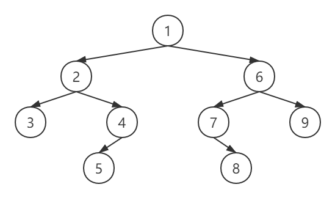

- [x] TODO

概述

二叉树是一种重要的树形结构，其特点是每个结点最多只有两个子树，且有左右之分。

A binary tree is a tree whose elements have at most 2 children.

#### 表示

##### 链表

```java
class TreeNode {
    int val;
    TreeNode left;
    TreeNode right;
}
```

##### 数组

```
// nums[0]为二叉树的根节点，对于任意父节点nums[i]，其左右子节点分别为nums[2*i+1]和nums[2*i+2]
nums[0,1,...,n-1]
```

#### 遍历

给定如图所示二叉树：



##### 前序遍历-VLR

先访问当前结点，再访问其左子树，最后访问其右子树。图示二叉树的前序遍历结果为[1,2,3,4,5,6,7,8,9].

```java
class BinaryTree {
    // 递归实现
    public void preorderTraversal(TreeNode node, Consumer<Integer> action) {
        if (node != null) {
            // 访问当前节点
            action.accept(node.val);
            preorderTraversal(node.left, action);
            preorderTraversal(node.right, action);
        }
    }
}
```

```java
class BinaryTree {
    // 栈实现
    public void preorderTraversalWithStack(TreeNode root, Consumer<Integer> action) {
        Stack<TreeNode> stack = new Stack<>();
        stack.push(root);
        while (!stack.isEmpty()) {
            TreeNode current = stack.pop();
            // 访问当前节点
            action.accept(current.val);
            // 先后将右子节点和左子节点入栈
            if (current.right != null) {
                stack.push(current.right);
            }
            if (current.left != null) {
                stack.push(current.left);
            }
        }
    }
}
```

##### 中序遍历-LVR

先访问当前结点的左子树，再访问当前结点，最后访问其右子树。图示二叉树的中序遍历结果为[3,2,,5,4,1,7,8,6,9].

```java
class BinaryTree {
    // 递归实现
    public void inorderTraversal(TreeNode node, Consumer<Integer> action) {
        if (node != null) {
            inorderTraversal(node.left, action);
            // 访问当前节点
            action.accept(node.val);
            inorderTraversal(node.right, action);
        }
    }
}
```

```java
class BinaryTree {
    // 栈实现
    public void inorderTraversalWithStack(TreeNode root, Consumer<Integer> action) {
        Stack<TreeNode> stack = new Stack<>();
        TreeNode current = root;
        do {
            // 将当前结点的最左路径（包括自身）入栈，即先进入左子树
            while (current != null) {
                stack.push(current);
                current = current.left;
            }
            if (!stack.isEmpty()) {
                // 退栈并访问结点
                current = stack.pop();
                action.accept(current.val);
                // 转向右子树
                current = current.right;
            }
        } while (current != null || !stack.isEmpty());
    }
}
```

##### 后序遍历-LRV

先访问当前结点的左子树，再访问其右子树，最后访问当前结点。图示二叉树的后序遍历结果为[3,5,4,2,8,7,9,6,1].

```java
class BinaryTree {
    // 递归实现
    public void postorderTraversal(TreeNode node, Consumer<Integer> action) {
        if (node != null) {
            inorderTraversal(node.left, action);
            inorderTraversal(node.right, action);
            // 访问当前结点
            action.accept(node.val);
        }
    }
}
```

```java
class BinaryTree {
    // 栈实现
    public void postorderTraversalWithStack(TreeNode root, Consumer<Integer> action) {
        TreeNode current = root;
        // 标记最后一次访问的结点
        TreeNode last = null;
        Stack<TreeNode> stack = new Stack<>();
        while (!stack.isEmpty() || current != null) {
            // 先将当前节点的最左路径上所有结点（包括自身）入栈，即先访问左子树
            while (current != null) {
                stack.push(current);
                current = current.left;
            }
            current = stack.peek();
            // 判断当前结点是否有右子树，或者右子树是否已经访问结束
            if (current.right == null || current.right == last) {
                // 如果是，访问当前结点
                action.accept(current.val);
                // 将当前结点出栈
                stack.pop();
                // 记下该结点
                last = current;
                current = null;
            } else {
                // 右子树存在且访问，则转向访问右子树
                current = current.right;
            }
        }
    }
}
```

##### 层序遍历

按层从左至右访问结点。图示二叉树的层序遍历结果为[1,2,6,3,4,7,9,5,6].

```java
class BinaryTree {
    // 队列实现（不分层）
    public void levelOrderTraversal(TreeNode root, Consumer<Integer> action) {
        if (root == null) {
            return;
        }
        Queue<TreeNode> queue = new LinkedList<>();
        queue.add(root);
        while (!queue.isEmpty()) {
            // 访问队列前端的结点
            TreeNode current = queue.remove();
            action.accept(current.val);
            // 将该结点左右子节点进队
            if (current.left != null) {
                queue.add(current.left);
            }
            if (current.right != null) {
                queue.add(current.right);
            }
        }
    }

    // 队列实现（分层）
    public void traverseLevels(TreeNode root, Consumer<List<Integer>> levelAction) {
        if (root == null) {
            return;
        }
        Queue<TreeNode> queue = new LinkedList<>();
        queue.add(root);
        while (!queue.isEmpty()) {
            // 访问当前层，并将左右子节点进队
            int size = queue.size();
            List<Integer> level = new ArrayList<>(size);
            for (int i = 0; i < size; i++) {
                TreeNode node = queue.remove();
                level.add(node.val);
                if (node.left != null) {
                    queue.add(node.left);
                }
                if (node.right != null) {
                    queue.add(node.right);
                }
            }
            levelAction.accept(level);
        }
    }
}
```

#### 参考

1. [二叉树的四种遍历方式 - 林海杜 - 博客园](https://www.cnblogs.com/du001011/p/11229170.html).
