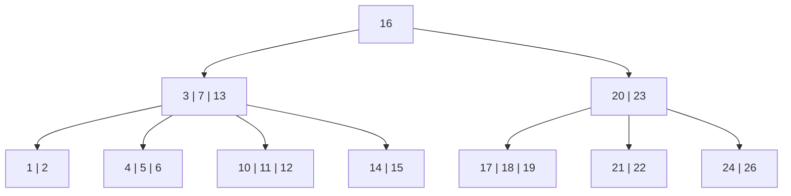

# B+ 树

[二叉搜索树](binary-search-tree.md)是一种常见的用来查找的数据结构，其问题在于，由于每个结点只容纳一个数据，导致树的高度较高。当在磁盘中存储数据时，由于磁盘的读写效率比内存低得多，使用二叉搜索树的查找效率会大大降低。因此，B树这种更加“扁平”的数据结构更适合在磁盘中存储数据：每个结点可以容纳更多数据，以降低树的高度，同时逻辑上相邻的数据在物理上也相近，从而减少磁盘的读写次数。

## B树

一个 $m$ 阶的B树满足以下性质：

1. 每个结点最多有 $m$ 个子结点；
2. 每个非叶子结点（除根结点外）最少有 $\lceil \frac{m}{2} \rceil$ 个子结点；
3. 如果根结点不是叶子结点，那么它最少有两个子结点；
4. 有 $k$ 个子结点的结点拥有 $k-1$ 个键（及数据），且升序排列；
5. 所有叶子结点都在同一层。

## 参考

- [B+ 树 - OI Wiki](https://oi-wiki.org/ds/bplus-tree/)
