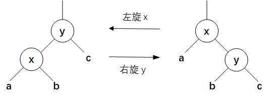
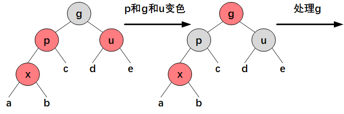
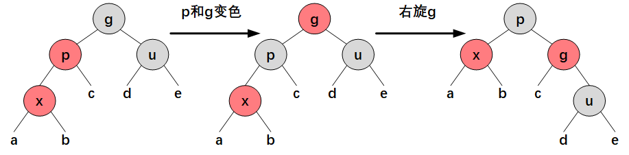
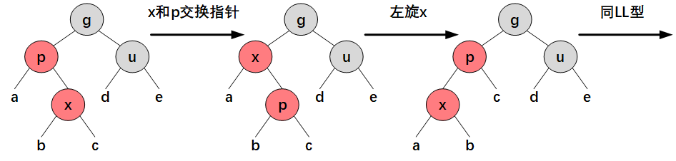
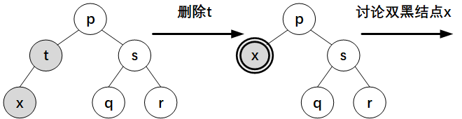
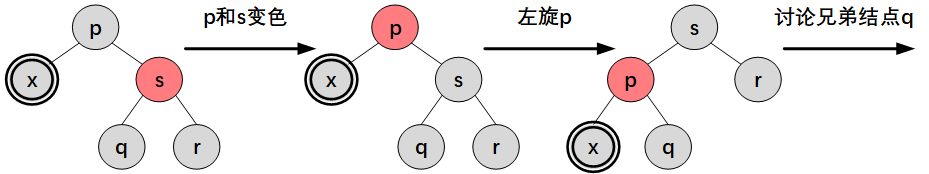
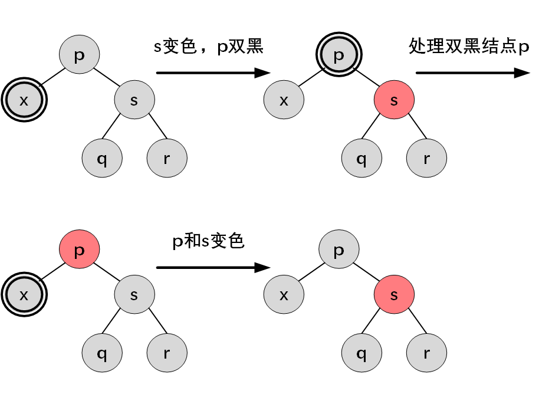
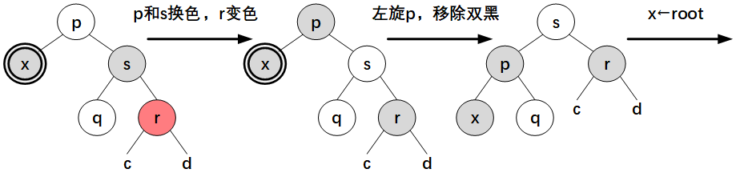
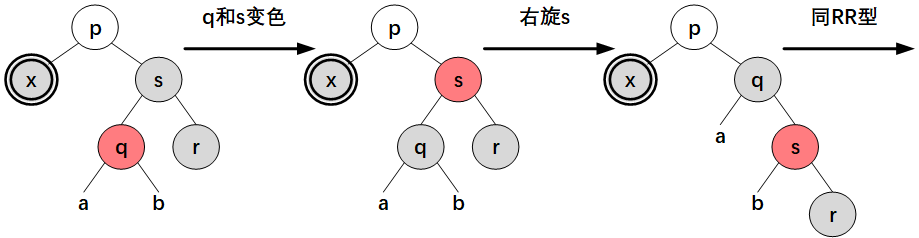

# 红黑树

红黑树是一颗二叉搜索树，它在每个结点上增加一个存储位表示该结点的颜色，RED 或 BLACK。通过对任意从根到叶子结点（NIL 结点）的简单路径上各结点颜色的约束，红黑树可以确保没有一条路径会比其他路径长出两倍，因而是近似**平衡**的。

```java
class RedBlackTree {

    static final boolean RED = false;
    static final boolean BLACK = true;

    TreeNode root;

    static class TreeNode {

        int val;
        TreeNode left;
        TreeNode right;
        TreeNode parent;
        boolean color = BLACK;

        TreeNode(int val, TreeNode parent) {
            this.val = val;
            this.parent = parent;
        }
    }
}

```

## 性质

红黑树满足以下性质：

1. 每个结点要么是红色的，要么是黑色的；
2. 根节点是黑色的；
3. 每个叶子结点（NIL）是黑色的；
4. 如果一个结点是红色的，则它的两个子结点都是黑色的；因此红色结点的父结点只能是黑色；
5. 对每个结点，从该结点到其所有后代叶子结点的简单路径上，均包含相同数目的黑色结点。

从某个结点 $x$ 出发（不包含该结点）到达一个叶子结点的任意一条简单路径上的黑色结点个数称为该结点的**黑高**，记作 $bh(x)$。红黑树的黑高为其根结点的黑高。

根据数学归纳法，结合性质 4 和 5 可得，以任一结点 $x$ 为根的子树中至少包含 $2^{bh(x)}-1$ 个内部结点（带关键字的结点）。

设 $h$ 为树的高度，$n$ 为树的内部结点的数目，根据性质 4 可知树的黑高至少为 $h/2$，从而

$$
n\ge 2^{bh} - 1 \ge 2^{h/2}-1
$$

取对数可得

$$
h \le 2\lg (n+1)
$$

即，**一棵有 $n$ 个内部结点的红黑树的高度至多为 $2\lg(n+1)$**，那么在红黑树的查找操作的时间复杂度为 $O(\lg n)$.

## 旋转

对红黑树执行常规的插入和删除操作后，结果可能不符合红黑树的性质，为了维护这些性质，需要修改某些结点的颜色和树的结构。通过**旋转**修改树的结构，仍能保持二叉搜索树的性质。



```java
class RedBlackTree {

    // rotate counterclockwise with t as the pivot point
    void rotateLeft(TreeNode t) {
        if (t != null) {
            TreeNode r = t.right;
            t.right = r.left;
            if (r.left != null) {
                r.left.parent = t;
            }
            r.parent = t.parent;
            if (t.parent == null) {
                root = r;
            } else if (t.parent.left == t) {
                t.parent.left = r;
            } else {
                t.parent.right = r;
            }
            r.left = t;
            t.parent = r;
        }
    }

    // rotate clockwise with t as the pivot point
    void rotateRight(TreeNode t) {
        if (t != null) {
            TreeNode l = t.left;
            t.left = l.right;
            if (l.right != null) {
                l.right.parent = t;
            }
            l.parent = t.parent;
            if (t.parent == null) {
                root = l;
            } else if (t.parent.left == t) {
                t.parent.left = l;
            } else {
                t.parent.right = l;
            }
            l.right = t;
            t.parent = l;
        }
    }
}
```

## 插入

先执行标准的[二叉搜索树插入算法](binary-search-tree.md#插入)，并将该结点设为红色，然后分情况讨论（设新插入的结点为 $x$）：

1. 如果 $x$ 是根结点，不满足性质 2，将其变为黑色（此时树的黑高增加 1）；
2. 如果 $x$ 的父结点 $p$ 为黑色，仍然满足红黑树的性质，树的黑高不变；
3. 否则 $x$ 不是根结点，且 $p$ 是红色，不满足性质 4，考虑 $x$ 的**叔父结点**，即祖父结点 $g$ 的另一个子结点 $u$ 的颜色。

（情形 3.1）如果 $u$ 是红色，那么将 $p$ 和 $u$ 变为黑色，$g$ 变为红色，然后对 $g$ 重复上述步骤。



（情形 3.2）如果 $u$ 是黑色，考虑 $p$ 和 $g$、$x$ 和 $p$ 的位置关系，根据不同情况进行旋转和变色：

- LL 型：$p$ 和 $x$ 分别是 $g$ 和 $p$ 的左子结点；
- LR 型：$p$ 是 $g$ 的左子结点，$x$ 是 $p$ 的右子结点；
- RR 型：LL 型的镜像；
- RL 型：LR 型的镜像。

如果为 LL 型，将 $p$ 变为黑色，$g$ 变为红色，然后以祖父结点 $g$ 为支点进行右旋，树的黑高不变。



如果为 LR 型，交换 $x$ 和 $p$ 的指针，以结点 $x$ 为支点进行左旋后，变为 LL 型。



```java
class RedBlackTree {

    boolean insert(int key) {
        TreeNode t = root;
        if (t == null) {
            root = new TreeNode(key, null);
            return true;
        }

        TreeNode p;
        int cmp;
        do {
            p = t;
            cmp = Integer.compare(key, t.val);
            if (key < t.val) {
                t = t.left;
            } else if (key > t.val) {
                t = t.right;
            } else { // if the key exists
                return false;
            }
        } while (t != null);

        t = new TreeNode(key, p);
        if (cmp < 0) {
            p.left = t;
        } else {
            p.right = t;
        }

        fixAfterInsertion(t);
        return true;
    }

    void fixAfterInsertion(TreeNode x) {
        x.color = RED;
        while (x != null && x.parent != null && x.parent.color == RED) {
            if (parentOf(x) == leftOf(parentOf(parentOf(x)))) {
                TreeNode u = rightOf(parentOf(parentOf(x)));
                if (colorOf(u) == RED) { // u is red
                    setColor(x.parent, BLACK);
                    setColor(u, BLACK);
                    setColor(parentOf(x.parent), RED);
                    x = parentOf(parentOf(x));
                } else {
                    if (x == rightOf(parentOf(x))) { // lr to ll
                        x = parentOf(x);
                        rotateLeft(x);
                    }
                    // fix ll
                    setColor(parentOf(x), BLACK);
                    setColor(parentOf(parentOf(x)), RED);
                    rotateRight(parentOf(parentOf(x)));
                }
            } else {
                TreeNode u = leftOf(parentOf(parentOf(x)));
                if (colorOf(u) == RED) { // u is red
                    setColor(parentOf(x), BLACK);
                    setColor(u, BLACK);
                    setColor(parentOf(parentOf(x)), RED);
                    x = parentOf(parentOf(x));
                } else {
                    if (x == leftOf(parentOf(x))) { // rl to rr
                        x = parentOf(x);
                        rotateRight(x);
                    }
                    // fix rr
                    setColor(parentOf(x), BLACK);
                    setColor(parentOf(parentOf(x)), RED);
                    rotateLeft(parentOf(parentOf(x)));
                }
            }
        }
        root.color = BLACK;
    }
}
```

## 删除

先执行标准的[二叉搜索树删除算法](binary-search-tree.md#删除)，设 $t$ 是最后删除的结点（如果目标结点有两个子结点，$t$ 为目标结点的后继结点），$x$ 是替换 $t$ 的子结点（可能为 `null`），分情况讨论：

1. 如果 $t$ 和 $x$ 中一个为红色，一个为黑色（根据性质 4 不可能均为红色），删除 $t$ 后将 $x$ 变为黑色，此时黑高不变；
2. 如果 $t$ 和 $x$ 均为黑色，且 $t$ 为根结点，删除后仍然满足红黑树的性质，此时树的黑高减一；
3. 否则，将 $x$ 标记为**双黑**（double black），考虑其**兄弟结点**，即父结点 $p$ 的另一个子结点 $s$.



（情形 3.1）如果 $s$ 是红色，将 $s$ 变为黑色，$p$ 变为红色，并以 $p$ 为支点进行左旋（$s$ 为 $p$ 的右子结点）或右旋（$s$ 为 $p$ 的左子结点），讨论 $x$ 的新的兄弟结点（原 $s$ 的子结点，所以必定是黑色）。



（情形 3.2）如果 $s$ 是黑色，且其子结点均为黑色，考虑 $p$ 的颜色：

- 如果 $p$ 为黑色，将 $s$ 变为红色，双黑标记改为 $p$ 结点，对双黑结点 $p$ 进行处理；
- 如果 $p$ 为红色，将 $s$ 变为红色，将 $p$ 变为黑色，树的黑高不变。



（情形 3.3）如果 $s$ 是黑色，且其至少有一个红色子结点，则根据 $s$ 和 $p$、红色子结点 和 $s$ 的位置关系分为四种情况，针对不同情况进行旋转和变色：

- RR 型：$s$ 是 $p$ 的右子结点，$s$ 的右子结点为红色，左子结点颜色任意；
- RL 型：$s$ 是 $p$ 的右子结点，$s$ 的左子结点为红色，右子结点为黑色；
- LL 型：RR 型的镜像；
- LR 型：RL 型的镜像。

如果为 RR 型，交换 $p$ 和 $s$ 的颜色，将 $r$ 变为黑色，然后以 $p$ 为支点进行左旋，移除双黑标记后两个子树黑色结点数恢复平衡。



如果为 RL 型，将 $s$ 变为红色，将其左子结点变为黑色，以 $s$ 为支点进行右旋后，变为 RR 型。



```java
class RedBlackTree {
    boolean delete(int key) {
        TreeNode t = search(key);
        if (t == null) {
            return false;
        }

        if (t.left != null && t.right != null) {
            // if the node has two children, swap the node with its successor
            TreeNode s = successor(t);
            t.val = s.val;
            t = s;
        }

        TreeNode replacement = t.left != null ? t.left : t.right;
        if (replacement != null) {
            // if the node has exactly one child, link its parent with its child
            replacement.parent = t.parent;
            if (t.parent == null) {
                root = replacement;
            } else if (t == t.parent.left) {
                t.parent.left = replacement;
            } else {
                t.parent.right = replacement;
            }

            t.left = t.right = t.parent = null;

            // Fix replacement
            if (t.color == BLACK) {
                fixAfterDeletion(replacement);
            }
        } else if (t.parent == null) { // if it's the only node.
            root = null;
        } else {
            // if no children, use self as phantom replacement and unlink
            if (t.color == BLACK) {
                fixAfterDeletion(t);
            }

            if (t.parent != null) {
                if (t == t.parent.left) {
                    t.parent.left = null;
                } else if (t == t.parent.right) {
                    t.parent.right = null;
                }
                t.parent = null;
            }
        }
        return true;
    }

    void fixAfterDeletion(TreeNode x) {
        while (x.color == BLACK && x.parent != null) {
            if (x == leftOf(parentOf(x))) {
                TreeNode s = rightOf(parentOf(x));
                if (colorOf(s) == RED) {
                    setColor(s, BLACK);
                    setColor(parentOf(x), RED);
                    rotateLeft(parentOf(x));
                    s = rightOf(parentOf(x));
                }

                if (colorOf(leftOf(s)) == BLACK && colorOf(rightOf(s)) == BLACK) {
                    setColor(s, RED);
                    x = parentOf(x);
                } else {
                    if (colorOf(rightOf(s)) == BLACK) { // rl to rr
                        setColor(s, RED);
                        setColor(leftOf(s), BLACK);
                        rotateRight(s);
                        s = rightOf(parentOf(x));
                    }

                    setColor(s, colorOf(parentOf(x)));
                    setColor(parentOf(x), BLACK);
                    setColor(rightOf(s), BLACK);
                    rotateLeft(parentOf(x));
                    x = root;
                }
            } else {
                TreeNode s = leftOf(parentOf(x));
                if (colorOf(s) == RED) {
                    setColor(s, BLACK);
                    setColor(parentOf(x), RED);
                    rotateRight(parentOf(x));
                    s = leftOf(parentOf(x));
                }

                if (colorOf(rightOf(s)) == BLACK && colorOf(leftOf(s)) == BLACK) {
                    setColor(s, RED);
                    x = parentOf(x);
                } else {
                    if (colorOf(leftOf(s)) == BLACK) { // lr to ll
                        setColor(s, RED);
                        setColor(rightOf(s), BLACK);
                        rotateLeft(s);
                        s = leftOf(parentOf(x));
                    }

                    setColor(s, colorOf(parentOf(x)));
                    setColor(parentOf(x), BLACK);
                    setColor(leftOf(s), BLACK);
                    rotateRight(parentOf(x));
                    x = root;
                }
            }
        }
        setColor(x, BLACK);
    }
}
```

## 参考

- Cormeo T H, et al. 算法导论. 原书第 3 版. 第 13 章.
- Sedgewick R, Wayne K. 算法. 第 4 版. 第 3.3 节.
- [Introduction to Red-Black Tree - GeeksforGeeks](https://www.geeksforgeeks.org/introduction-to-red-black-tree/)
- [TreeMap (Java SE 17 & JDK 17)](https://docs.oracle.com/en/java/javase/17/docs/api/java.base/java/util/TreeMap.html)
