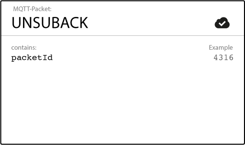

## 基础

MQTT 采取发布/订阅（publish/subscribe）机制，客户端（client）之间的通信通过 Broker 分发，以实现客户端之间的解耦。

其中，客户端可以是任何设备，通过 TCP/IP 协议连接 broker，既可以作为发布者（publisher），也可以作为订阅者（subscriber）。Broker 则是整个机制的核心，负责客户端的认证和授权，保持和客户端的会话，以及处理所有消息的接收、筛选和分发。

### 连接

建立连接时，客户端先向 broker 发送一个连接（connect）消息，内容如下，

Broker 接收到上述内容后，需要发送一个连接应答（connack）消息，包括会话状态和响应码。

### 发布

一旦和 broker 建立了连接，客户端就可以发布消息了。

### 订阅/退订

为了获取特定的消息，客户端需要向 broker 发送订阅消息。

接收到订阅消息后，broker 会发送订阅应答（suback）消息，以确认每一个订阅。

退订（unsubscribe）流程和订阅相似。

### Topic

MQTT 消息是基于 topic 的，每个消息都必须包含一个 topic，broker 根据 topic 进行消息的筛选和分发。Topic 由分级的字符串定义，例如 `myhome/groundfloor/livingroom/temperature`，其中 `/` 是 topic 的分级符号。也可以使用通配符，`+` 表示单级，`#` 表示多级（只能用在结尾），例如 `myhome/+/groundfloor/#`.

### QoS

服务质量（Quality of Service）是消息发送者（sender）和接收者（receiver）之间的协议，包括三个级别。

当 QoS=0 时，对于发送者发送的一条消息，接收者最多能收到一次，如果发送失败，不会重试。

当 QoS=1 时，如果消息发送失败，发送者会重试，保证接收者至少收到一次（即收到消息应答），但接收者有可能收到重复的消息。

当 QoS=2 时，在 Qos=1 的基础上，保证接收者不会因为消息重传收到重复的消息，需要至少两次的请求-应答。

> QoS 是消息发送和接收双方的协议，而非发布者和订阅者之间的协议。

## Mosquitto

## EMQX

## 参考

- [MQTT Essentials](https://www.hivemq.com/mqtt-essentials/)
- [MQTT Specifications](https://mqtt.org/mqtt-specification/)
- [Documentation | Eclipse Mosquitto](https://mosquitto.org/documentation/)
- [EMQX 5.0 文档](https://www.emqx.io/docs/zh/v5.0/getting-started/getting-started.html)
