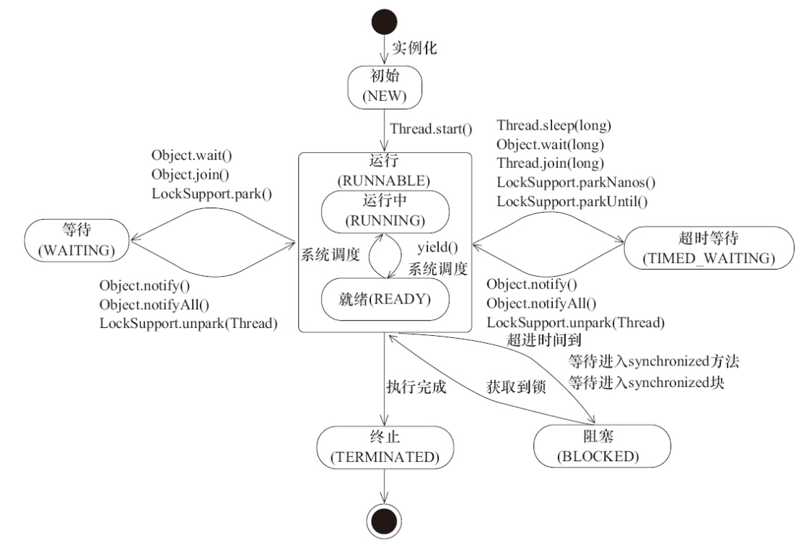

# Concurrency

## 线程状态状态



其中，Running 表示线程正在执行，Ready 表示线程准备就绪但是当前 CPU 时间片被分配给其他线程。

## 锁

### 悲观锁/乐观锁

乐观锁在 Java 中通过 CAS 算法实现。

```java
class AtomicInteger {
    public final int getAndUpdate(IntUnaryOperator updateFunction) {
        int prev, next;
        do {
            prev = get();
            next = updateFunction.applyAsInt(prev);
        } while (!compareAndSet(prev, next));
        return prev;
    }
}
```

`synchronized` 关键字和 `Lock` 接口的实现类都是悲观锁。

### 自旋锁/自旋适应锁

正常情况下，锁获取失败，线程会阻塞，等待锁的释放。但是线程的阻塞和唤醒需要切换到内核态，有一定的性能损耗。如果锁很快就会被释放，比如同步代码块比较简单，那么可以使用自旋锁，不阻塞线程而执行自旋操作，等待锁的释放。自旋操作一般是空转的 `while` 循环。但自旋等待的时间有一定限度，默认自旋等待次数是 10 次。

自旋适应锁，指的是自旋的时间不是固定的，而是由前一次在同一个锁上的自旋时间和锁的拥有者的状态来决定。

### 偏向锁/轻量级锁/重量级锁

偏向锁使用了一种**等到竞争出现才释放锁**的机制。

轻量级锁是相对于需要操作系统状态转换的重量级锁而言的。

### Synchronized

## Happens-before

1. 如果一个操作 Happens-before 另一个操作，那么第一个操作的执行结果将对第二个操作可见，而且第一个操作的执行顺序排在第二个操作之前。
2. 两个操作之间存在 Happens-before 关系，并不意味着 Java 平台的具体实现必须要按照 Happens-before 关系指定的顺序来执行。如果重排序之后的执行结果，与按 Happens-before 关系来执行的结果一致，那么这种重排序并不非法（也就是说，JMM 允许这种重排序）

## volatile

当一个变量被声明为 `volatile` 时，JVM 会保证每次读取变量的值时都从主存中读取，而不会缓存变量的值；而且对它的操作不会被重排序。

使用标准：

- 写入变量时并不依赖变量的当前值；或者只有单一的线程修改变量的值；
- 变量不需要和其他状态变量共同参与不变约束；
- 访问变量时，没有其他原因需要加锁。

## FAQ

对于非 `volatile` 的 `long` 和 `double` 变量，JVM 允许将 64 位的读写拆分为两个 32 位的读写。

## 参考

- [Lesson: Concurrency (The Java™ Tutorials > Essential Java Classes)](https://docs.oracle.com/javase/tutorial/essential/concurrency/index.html)
