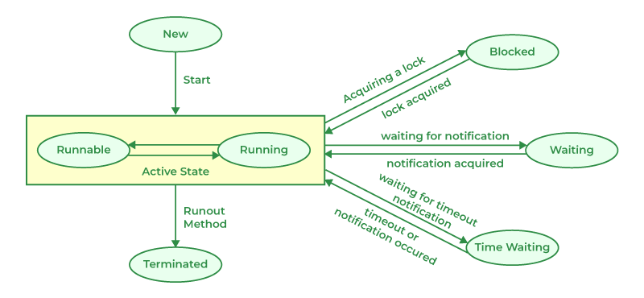

# Concurrency

## 生命周期和状态

其中，Running 表示线程正在执行，Runnable 表示线程准备就绪但是当前 CPU 时间片被分配给其他线程。

## 参考

- [Lesson: Concurrency (The Java™ Tutorials > Essential Java Classes)](https://docs.oracle.com/javase/tutorial/essential/concurrency/index.html)
