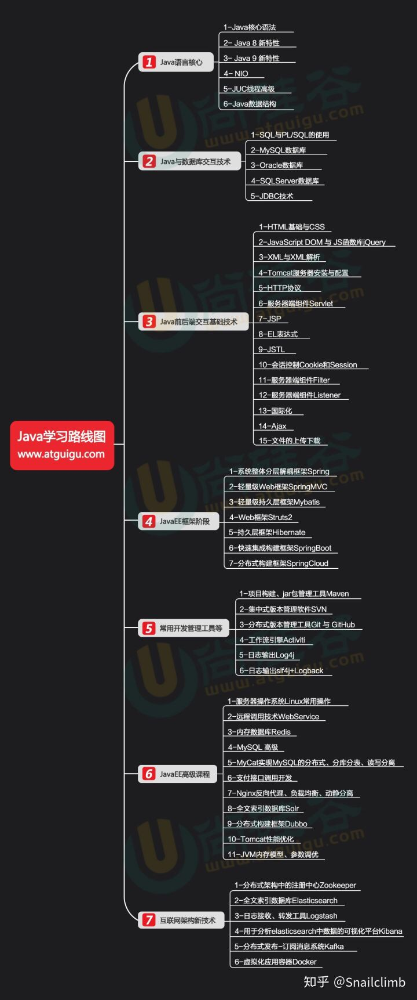

#### 概述

学习世界上最好的编程语言—— [Java](https://www.oracle.com/java/)!
本文档基于 [Java 11](https://docs.oracle.com/en/java/javase/11/).

#### 安装

下载安装 JDK 并按如下配置环境变量（其中*dir*为安装目录）：

```
JAVA_HOME=%dir%\jdk_version
path=.;%JAVA_HOME%\bin;%JAVA_HOME%\jre\bin;

# 如果同时安装多个版本
JAVA_HOME=%JAVA_HOME11% # 指定当前版本
JAVA_HOME8=%dir%\jdk1.8
JAVA_HOME11=%dir%\jdk11
```

**注意**: 删除安装时自动添加到系统目录 *C:\Windows\System32* 下的 *java.exe*, *javaw.exe*, *javaws.exe*.

#### 学习路线



#### 参考

1. Java 核心技术 10. 卷I & 卷II.
2. [On Java 8. 中文版](https://lingcoder.gitee.io/onjava8/#/sidebar).
1. 基于 JDK8 的 [Java 教程](https://docs.oracle.com/javase/tutorial/index.html).
2. [Java SE & JDK 11 API 规范](https://docs.oracle.com/en/java/javase/11/docs/api/index.html).
3. [Java 虚拟机](https://docs.oracle.com/en/java/javase/11/vm/index.html).
4. [Java 语言规范](https://docs.oracle.com/javase/specs/jls/se11/html/index.html).
5. [JVM 规范](https://docs.oracle.com/javase/specs/jvms/se11/html/index.html).
6. [Java EE 教程](https://docs.oracle.com/javaee/7/tutorial/index.html).
7. [Overview (Java Platform SE 8 )](https://docs.oracle.com/javase/8/docs/api/).
8. [Overview (Java SE 11 & JDK 11 )](https://docs.oracle.com/en/java/javase/11/docs/api/index.html).
9. [官方帮助文档](https://docs.oracle.com/apps/search/search.jsp?category=java&q=).