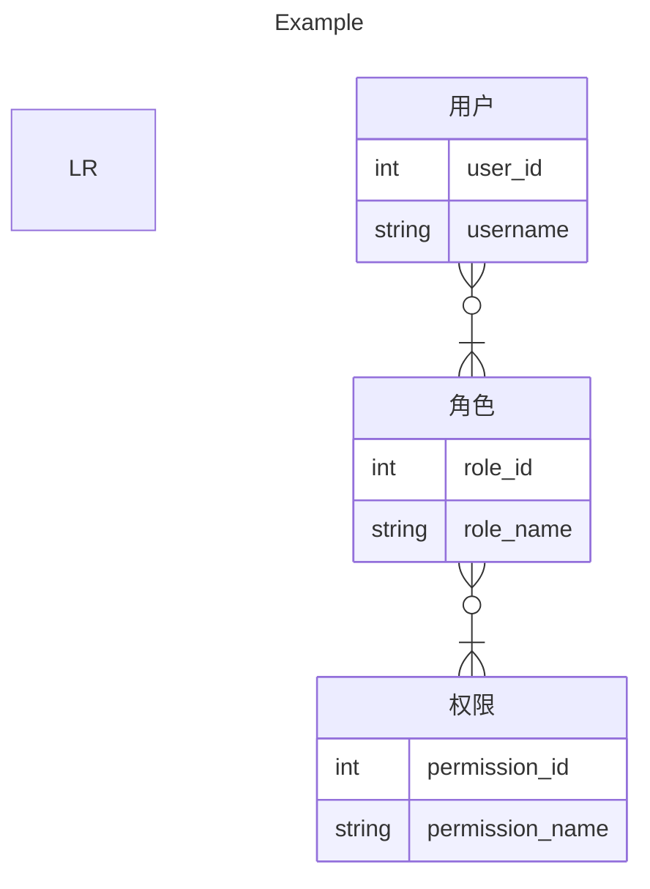

# Mermaid

## ER图

```markdown
---
title: Example
---
erDiagram LR
    User["用户"] {
        int user_id
        string username
    }
    Role["角色"] {
        int role_id
        string role_name
    }
    Permission["权限"] {
        int permission_id
        string permission_name
    }
    User }o--|{ Role : ""
    Role }o--|{ Permission : ""
```



## 参考

- [About Mermaid | Mermaid](https://mermaid.js.org/intro/)
